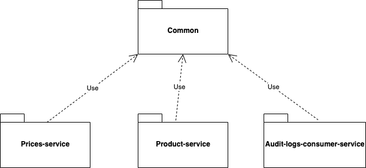

# Compile and run

## Compile all the project:

Change dir to root folder of the project and run the following command:

`mvn clean install`

## Compile and run the prices-service:

Change dir to prices-service subfolder and run the following command:

`mvn compile exec:java -Dspring.profiles.active=dev -Dexec.mainClass=com.smartchoice.prices.PricesApplication`

## Compile and run the product-service:

Change dir to product-service subfolder and run the following command:

`mvn compile exec:java -Dspring.profiles.active=dev -Dexec.mainClass=com.smartchoice.product.ProductApplication`

## Compile and run the audit-logs-consumer-service:

Change dir to audit-logs-consumer-service subfolder and run the following command:

`mvn compile exec:java -Dspring.profiles.active=dev -Dexec.mainClass=com.smartchoice.consumer.AuditLogsConsumerApplication`

# Test samples

Add products:

`curl -X POST "http://localhost:8080/api/admin/products/" -H "accept: */*" -H "Content-Type: application/json" -d "{ \"images\": [ \"https://cdn.tgdd.vn/Products/Images/42/225380/iphone-mini-do-new-600x600-600x600.jpg\", \"https://cdn.tgdd.vn/Products/Images/42/225380/iphone-mini-trang-new-600x600-200x200.jpg\" ], \"name\": \"iPhone 12 mini 64GB\"}"`

`curl -X POST "http://localhost:8080/api/admin/products/" -H "accept: */*" -H "Content-Type: application/json" -d "{ \"images\": [ \"https://cdn.tgdd.vn/Products/Images/42/226099/samsung-galaxy-z-fold-2-vang-dong-200x200.jpg\", \"https://cdn.tgdd.vn/Products/Images/42/226099/samsung-galaxy-z-fold-2-den-200x200.jpg\" ], \"name\": \"Samsung Galaxy Z Fold2 5G\"}"`

Search products:

`curl -X POST "http://localhost:8080/api/products/search" -H "accept: */*" -H "Content-Type: application/json" -d "{ \"productName\": \"iphone\"}"`

Get product details:

`curl -X GET "http://localhost:8080/api/products/1" -H "accept: */*"`

Get Prices (internal call from Product Service to Prices Service)

`curl -X GET "http://localhost:8081/api/prices?productId=1" -H "accept: */*"`

Get Audit Logs 

`curl -X GET "http://localhost:8082/api/logs" -H "accept: */*"`

# Project Design

## Package Structure

* common module
    * Contains common DTO classes, interfaces and utilities
* prices-service module
    * Contains source codes for building prices-service which can be packaged as a microserice.

* product-service module
    * Contains source codes for building product-service which can be packaged as a microserice.
* audit-logs-consumer-service module
    * Contains source codes for building audit-logs-consumer-service which can be packaged as a microserice.

## Component Diagram

* Prices Service
  * Collect product prices from partner sites (Tiki, Lazada, Shopee, ...). The current implementation is just simulating the prices using a random function. The real implementation will be based on the details of APIs which provided from partners.
  * Expose REST APIs for getting prices from other internal services (product service).
  * The collected prices can be cached in a cache server (Redis, ...). In dev environment, we can use in memory cache which is supported by Spring.
    
* Product Service
  * Get product prices from Prices Service via REST calls.
  * Expose REST APIs for searching products, getting product details (prices, images, ...)
  * User actions can be stored for auditing, for not impacting users while storing the audit logs, instead of storing the logs directly to the db, the logs can be sent to a queue, other service will consume log messages the queue then write to database (This means we are applying publisher-subscriber design pattern to resolve the performance issue).
  * In dev environment, the queue server can be run as embedded mode and started while starting the product service.
    
* Audit Logs Consumer Service
  * Consume log messages from the queue server then write the messages to database.

## Class Diagram

## ERD Diagram

## Deployment Diagram

* The deployment is based on assuming that we will deploy the services on cloud. All the services are in a K8S Cluster. Each service is configured that can be scalable. 
